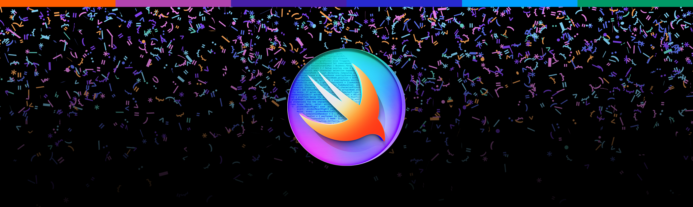

---

## 👀 A First Overview

Welcome to this year's **WWDC24** Swift Student Challenge! I'm very proud to present you my submission called `Contexto`. I wanted to take part in this challenge to deepen my newly gained coding skills and learn more about the amazing world of app development with Swift and SwiftUl.

My aim is to learn as many new things as possible through this challenge. That's why I tried to go beyond myself and explore new things. For this reason, I decided to develop a playful word quiz game based on natural language processing.

On the one hand, the "Natural Language" library helped me to calculate word embeddings to find a given number of "neighbors" that are most similar to a certain word. On the other hand, I used this library for lemmatization to determine the stem of a word.

At the beginning of the game, the player is given a hidden word along with the corresponding context. By guessing, the player tries to figure out the hidden word. For each guessed word that appears in the list of neighbors, the player receives up to ten points. These points can be redeemed to reveal any of the ten most similar words.

Since this is a game, gamification is a must. Therefore, I used "AVFoundation" to add sound effects for certain interactions to enhance the overall experience.

By using the new "TipKit" library, I tried to make it easier for first-time users to quickly understand what Contexto is about.

## 📱 Used Technologies
* SwiftUI
* Natural Language
* TipKit
* AVFoundation

## ⚙️ System Requirements
_Developed with_
* Xcode 15.3 with Swift 5.10.0 on macOS 14.4.1

_Tested with_
* iPadOS Simulator 17.4

## 🎊 Sneak Peek
 
 
 
